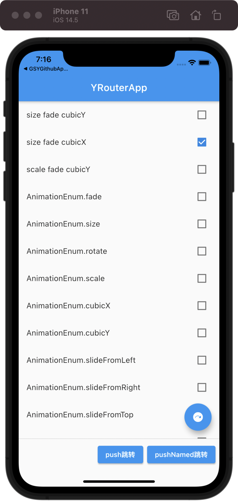

```
一个用于帮助 flutter APP widget间跳转的工具
```

# y_router

🧑‍💻 Route animation by using flutter's transition widget




## Getting Started

### Add dependency

```yaml
dependencies:
  y_router: ^1.0.1

```

## Examples

Your can use **YRouter** to push route

```
YRouter.push(
    context: context,
    type: AnimationEnum.cubicY,
    target: SecondPageWidget(),
);
```

or use Navigator to push route

```
fianl route = YRouter.buildRoute(target: SecondPageWidget(), animationTypes: [
          AnimationEnum.size,
          AnimationEnum.fade,
          AnimationEnum.cubicY],
            currentPage: settings.arguments as Widget,
            transitionMs: 2000);

Navigator.push(context, route);

```

or

```
onGenerateRoute: (settings) {
    return YRouter.buildRoute(target: SecondPageWidget(), animationTypes: [
      AnimationEnum.size,
      AnimationEnum.fade,
      AnimationEnum.cubicY],
        currentPage: settings.arguments as Widget,
        transitionMs: 2000);
},
```

You can choose the following types And supports multiple

```
enum AnimationEnum {
  fade,
  size,
  rotate,
  scale,
  cubicX,
  cubicY,
  slideFromLeft,
  slideFromRight,
  slideFromTop,
  slideFromBottom
}

```

You have learned 👍 
